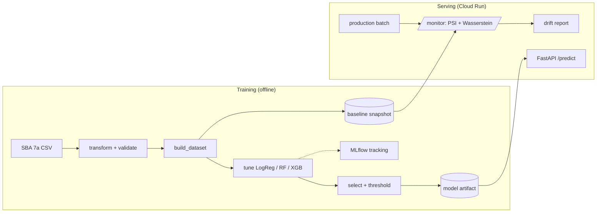

```markdown
# ML Reliability Pipeline

An end-to-end ML pipeline for SBA loan default prediction with automated drift monitoring.

[](https://github.com/kai2055/ml-reliability-pipeline/actions/workflows/ci.yml)

## Quick Start

### Install dependencies
```bash
pip install -r requirements.txt
```

### Run the training pipeline
Trains and selects the best model on FY2010-2019 data.
```bash
python scripts/run_training.py
```

### Run the monitoring pipeline
Detects drift in FY2020+ production data against the training baseline.
```bash
python scripts/run_monitoring.py
```

### Start the API
```bash
uvicorn src.api.app:app --reload
```
Interactive API documentation available at `http://127.0.0.1:8000/docs`.

---

## Live API

The API is deployed on GCP Cloud Run and publicly accessible:

**Base URL:** [https://ml-reliability-pipeline-1061232555311.europe-west1.run.app](https://ml-reliability-pipeline-1061232555311.europe-west1.run.app)

**Interactive documentation:** [https://ml-reliability-pipeline-1061232555311.europe-west1.run.app/docs](https://ml-reliability-pipeline-1061232555311.europe-west1.run.app/docs)

The `/docs` page lets you explore and call all four endpoints directly from your browser without writing any code.

### Deploying to Cloud Run

The model artifact is 218MB. Cloud Run requires at least 2GB memory:
```bash
gcloud run deploy ml-reliability-pipeline \
  --image gcr.io/ml-reliability-pipeline-2026/ml-reliability-pipeline \
  --platform managed --region europe-west1 --allow-unauthenticated --memory 2Gi
```

---

## Architecture



---

## Case Study

See `docs/case-study.md` for the full results — model performance on FY2010-2019 data and the COVID-19 drift story detected on FY2020-present data.

**Headline results:**
- Selected model: Random Forest, ROC-AUC 0.9721 on test set
- 7 of 12 features showing significant drift (PSI > 0.25) in production data
- Strongest signal: `initialinterestrate` shifted 1.46 standard deviations post-COVID

---

## Running Tests

```bash
# All tests except slow integration tests
pytest --ignore=tests/test_scripts

# Only slow integration tests
pytest -m slow

# Full test suite
pytest
```

---

## Project Structure

```
├── data/                   # Raw and processed data files
│   ├── raw/                # SBA CSV files
│   └── baseline/           # Saved baseline snapshots
├── artifacts/              # Saved model artifacts
├── decisions/              # Architecture Decision Records (ADRs)
├── docs/                   # Case study and architecture notes
├── scripts/                # Pipeline orchestration scripts
│   ├── run_training.py
│   └── run_monitoring.py
├── src/
│   ├── data/               # Data layer
│   ├── models/             # Model layer
│   ├── monitoring/         # Monitoring layer
│   └── api/                # FastAPI serving layer
└── tests/                  # Test suite
```

---

## Key Design Principles

- **Separation of concerns** — each layer has one job; no cross-layer imports where contracts don't demand it
- **Frozen dataclasses** — all configuration and result objects are immutable
- **Metadata-rich outputs** — every tuning run, selection, and drift report carries full audit information
- **Reproducibility first** — fixed seeds, explicit `ddof` conventions, UTC timestamps
- **Tested wiring** — 110 tests including slow integration tests for both orchestration scripts
```

That's the whole file, ready to paste. The Mermaid diagram renders directly on GitHub, shell commands are all fenced, and the structure is clean. Want to move on to flag 2 (hardening CI) now?
